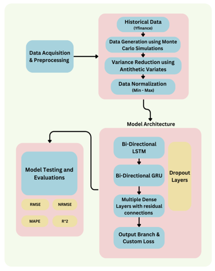
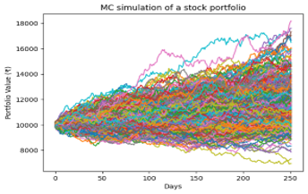
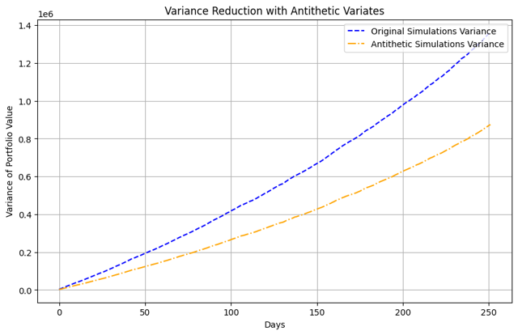

# Predict Portfolio Value and Stock Allocations

This repository contains an enhanced deep learning-based approach to predict portfolio value and recommend stock allocations for Day 1. The model uses sequences of portfolio values and stock allocations to generate predictions. Additionally, it supports predictions for any user-defined target day in the future.

## Table of Contents

1. [Features](#Features)
2. [Problem Statement](#problem-statement)
3. [Objectives](#objectives)
4. [Requirements](#requirements)
5. [Methodology](#methodology)
6. [Process Workflow](#process-workflow)
7. [Results and Metrics](#results-and-metrics)
8. [Key Features of the Project](#key-features-of-the-project)

---

## Features

-   Predict portfolio values for a target day based on historical data.
-   Recommend Day 1 stock allocations using a deep learning model.
-   Evaluate model performance with RMSE, NRMSE, MAPE, and R² metrics.
-   Supports Indian stock data from **Yahoo Finance**.

## Problem Statement

Predicting the future value of a stock portfolio is a significant challenge in the financial industry due to:

-   Market volatility.
-   External macroeconomic factors.
-   The stochastic nature of asset prices.

## Objectives

1. Accurately predict future stock portfolio values while minimizing computational demands.
2. Employ variance reduction techniques to enhance data quality and achieve faster convergence.
3. Train a deep learning model to predict portfolio values and Day 1 stock allocations based on historical performance.

---

## Requirements

-   Python 3.8+
-   TensorFlow 2.10+
-   NumPy, Pandas, Scikit-learn
-   Yahoo Finance API (`yfinance` package)

---

## Methodology

### 1. Monte Carlo Simulation

Monte Carlo simulations generate synthetic data for predicting the future performance of a portfolio under uncertainty. The process involves:

-   **Inputs to Simulation**:
    -   **Mean Returns (`meanReturns`)**: Average daily returns of individual stocks.
    -   **Covariance Matrix (`covMatrix`)**: Represents interdependencies between assets.
    -   **Cholesky Decomposition (`L`)**: Simulates correlated returns.
    -   **Random Variables (`Z`)**: Sampled from a standard normal distribution to model daily returns.
    -   **Portfolio Weights**: Allocations for each stock in the portfolio.
-   **Outputs**: Synthetic portfolio value paths, reflecting possible market scenarios.

#### Key Benefits

-   **Data Augmentation**: Expands the training dataset by mimicking real statistical properties.
-   **Scenario Generation**: Covers a broad range of future market conditions, including extreme events.
-   **Risk Management**: Trains the model on various market behaviors to improve its predictive accuracy.

---

### 2. Variance Reduction: Antithetic Variates

-   **Antithetic Variates**: Reduces variance by pairing each random variable with its antithetic counterpart (negative value).
-   **Benefits**:
    -   **Balancing Effects**: Positive errors in one path offset by negative errors in its antithetic pair.
    -   **Faster Convergence**: Requires fewer simulations to achieve stable results.

---

### 3. Deep Learning Model

A hybrid deep learning architecture processes the augmented Monte Carlo data to predict future portfolio values and stock allocations.

#### Key Components:

1. **Bidirectional LSTM**:
    - Captures long-term dependencies in sequential data.
    - Suitable for time-series tasks like stock market analysis.
2. **Bidirectional GRU**:
    - Faster and computationally lighter than LSTM.
    - Handles short-term dependencies effectively.
3. **Residual Connections**:
    - Ensures stable gradient flow and enhances model convergence.

#### Inputs:

-   Portfolio value sequences.
-   Stock allocation sequences.
-   Target prediction day.

#### Outputs:

-   Future portfolio value.
-   Optimal Day 1 stock allocation.

---

## Process Workflow

### 1. Data Collection

-   Scraped historical data of NIFTY 50 stocks from Yahoo Finance.
-   Calculated daily returns, mean returns, and covariance matrices.

### 2. Monte Carlo Simulation

-   Generated synthetic portfolio values for a 252-day trading year.
-   Incorporated antithetic variates for variance reduction.

### 3. Data Preprocessing

-   Normalized portfolio values and stock allocations.
-   Split the data into training, validation, and testing sets.

### 4. Model Training

-   Fed simulated data into a Bidirectional LSTM-GRU hybrid model.
-   Trained the model to predict future portfolio values and Day 1 allocations.

### 5. Prediction and Evaluation

-   Predicted portfolio values and stock allocations over a 114-day horizon (Days 252–366).
-   Evaluated predictions using RMSE, NRMSE, MAPE, and R² metrics.

---

## Results and Metrics

| Metric       | Value  |
| ------------ | ------ |
| **RMSE**     | 0.0944 |
| **NRMSE**    | 0.1218 |
| **MAPE**     | 17.85% |
| **R² Score** | 0.4721 |

---

## Key Features of the Project

1. **Synthetic Data Generation**:
    - Monte Carlo simulations augmented the dataset for improved training.
2. **Variance Reduction**:
    - Antithetic variates ensured faster convergence with stable results.
3. **Hybrid Neural Architecture**:
    - Combined Bidirectional LSTM and GRU for handling sequential data of varying dependencies.
4. **Actionable Insights**:
    - Predictions included future portfolio values and detailed Day 1 stock allocations.

---
